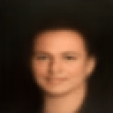

# 🚀 DeepFakeLab
Welcome to DeepFakeLab, your go-to repository for exploring the exciting realm of image manipulation through advanced generative models.

## ⚡ Overview
DeepFakeLab is designed to empower users to seamlessly integrate features into images, leveraging state-of-the-art generative techniques. Whether you're interested in enhancing facial expressions, experimenting with creative customization, or diving into educational exploration in computer vision, this repository has you covered.

## 👽 Creating vector feature

In here, we will calculate vector about atribute that we want insert. In this, we calculate Bald vector atribute and will insert in another images. The math about this trick is very simple! First, define your subset with True for your feature C, in another words: 

$$\mathcal{A}_{[C==1]} = \lbrace \phi(x) | x_c == 1 \rbrace$$

Where $\phi(x) = z \in \mathbb{R}^{32}$ (The encoder of my autoencoder). And, the same idea for instances that C is False:

$$\mathcal{B}_{[C==0]} = \lbrace \phi(x) | x_c == 0 \rbrace$$

In this context, we will undersample one of subsets to turn this sentence true:

$$ | \mathcal{A} | \sim | \mathcal{B} | $$

Then, we calculate two centroids, for each subsets: 

$$ Cm_{A} = \frac{\sum_{x \in \mathcal{A}} \phi(x)}{n(\mathcal{A})} $$

$$ Cm_{B} = \frac{\sum_{x \in \mathcal{B}} \phi(x)}{n(\mathcal{B})} $$

Finally, we can extract vector atribute:

$$\vec v = \vec Cm_{A} - \vec Cm_{B}$$

## 🔮 Insert feature

In this context, we already have a vector feature (yay!), so we can incorporate this feature using a simple mathematical operation:

$$FakeImage = \psi(\phi(x) + \sum_{i} t_i \cdot \vec v_i)$$

Where $x \in B$, $t \in \mathbb{R}$ and $\psi$ is decoder!

## Key Features

- Feature Integration: Insert a variety of features into images using advanced generative models.

- Creative Exploration: Explore creative possibilities for artistic expression, design, and entertainment.

- Applications: Go ahead and feel free to explore new application. For example, you can use this technique to create new instances and 

## Neural Networks Architectures 

Basically, we will use Convolutional Variational Autoencoders (VAE), Generative Adversarial Networks (GAN) and Diffusion Models (DM). 

We explore another auxiliar loss functions using sobel filters to capture high frequency feature from images!

$$L_{sobel} = \gamma \cdot |f(I) - f(\psi(\phi(I)))|$$

where $f(I) = \sqrt{(G_x \ast I)^{2} + (G_y \ast I)^{2}}$, and $\gamma \in \mathbb{R}$.

So, if we using VAE architecture, our loss will be:

$$\mathcal{L} = L_{reconstruction} + \text{DKL} + \gamma \cdot L_{sobel}$$

$$\mathcal{L} = |I - \psi(\phi(I))|^{2} -\frac{1}{2} \sum_{i=1}^{N} \left(1 + \log(\sigma_i^2) - \mu_i^2 - \sigma_i^2\right) + \gamma \cdot |f(I) - f(\psi(\phi(I)))|$$

$$\mathcal{L} = |I - \psi(\phi(I))|^{2} + \mathbb{E}_{\phi(z | x)} \left[ \log \frac{\phi(z | x)}{\psi(z)} \right] + \gamma \cdot |f(I) - f(\psi(\phi(I)))|$$

(GAN and DM are still building... ⌛)

## Transitions beetween multiple instances

In this context, we will use a simple trick to create a transition between two instances. The idea is simple:

1. Calculate the vector encode for each instance: $\phi(x_1)$ and $\phi(x_2)$
2. Create a linear space between these two vectors: $\mathcal{L} = \lbrace \phi(x_1) + \alpha \cdot (\phi(x_2) - \phi(x_1)) | \alpha \in [0, 1] \rbrace$
3. Pick a subset of $\mathcal{L}$, denoted by $\mathcal{L}_{sub}$ and insert in decoder: $\psi(\mathcal{L}_{sub})$
4. Finally, we will have a transition between two (or more) instances!

    

        
    

## ❓ How to Use

Explore the capabilities of DeepFakeLab by following the provided tutorials in notebooks. Contribute to the community by sharing your insights, enhancements, or creative projects.

## 🌟 Contributions

Community contributions are highly encouraged. Whether you're fixing bugs, adding new features, or enhancing existing ones, your input is valuable in making DeepFakeLab a robust and versatile tool for image manipulation.

## 💥 Disclaimer

This repository is intended for educational and creative purposes. Users are reminded to consider ethical guidelines and legal implications when using DeepFakeLab. The maintainers are not responsible for any misuse or unintended consequences. 

## 😎 Get Started
Dive into the world of generative image manipulation with DeepFakeLab. Clone the repository, follow the setup instructions, and unlock new dimensions of creative expression!

Happy exploring! 🚀