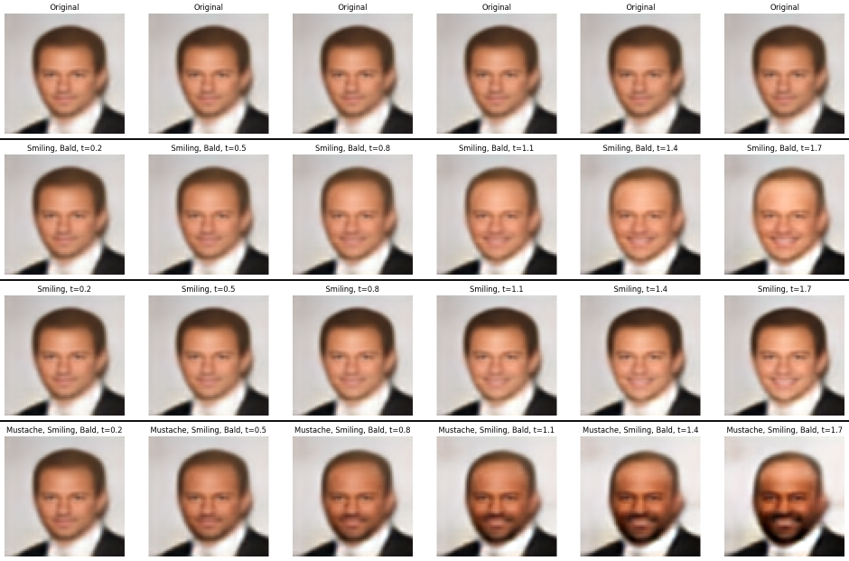

# DeepFakeLab
Welcome to DeepFakeLab, your go-to repository for exploring the exciting realm of image manipulation through advanced generative models.

## Overview
DeepFakeLab is designed to empower users to seamlessly integrate features into images, leveraging state-of-the-art generative techniques. Whether you're interested in enhancing facial expressions, experimenting with creative customization, or diving into educational exploration in computer vision, this repository has you covered.

## Creating vector feature

In here, we will calculate vector about atribute that we want insert. In this, we calculate Bald vector atribute and will insert in another images. The math about this trick is very simple! First, define your subset with True for your feature C, in another words: 

$$\mathcal{A}_{[C==1]} =\{ {\phi(x) ; X_c == 1}\}$$

Where $\phi(x) = z \in \mathbb{R}^{32}$ (The encoder of my autoencoder). And, the same idea for instances that C is False:

$$\mathcal{B}_{[C==0]} =\{ {\phi(x) ; X_c == 0}\}$$

In this context, we will undersample one of subsets to turn this sentence true: $n(\mathcal{A}_{[C==1]}) \approx n(\mathcal{B}_{[C==0]})$.

Then, we calculate two centroids, for each subsets: 

$$Cm_{A} = \frac{\sum_{x \in A} \phi(x)}{n(\mathcal{A}_{[C==1]})} $$

$$Cm_{B} = \frac{\sum_{x \in B} \phi(x)}{n(\mathcal{B}_{[C==0]})} $$

Finally, we can extract vector atribute:

$$\vec v = \vec Cm_{A} - \vec Cm_{B}$$

So, let's calculate this vector!

## Insert feature

In this context, we already have vector feature (yay!), so we can insert feature with this simple math: 

$$FakeImage = \psi(\phi(x) + t \cdot \vec v)$$

Where $x \in B$, $t \in \mathbb{R}$ and $\psi$ is decoder!

## Key Features
- Feature Integration: Insert a variety of features into images using advanced generative models.

- Advanced Generative Techniques: Benefit from cutting-edge methods to generate realistic and detailed synthesized images.

- Creative Exploration: Explore creative possibilities for artistic expression, design, and entertainment.

Educational Resource: DeepFakeLab serves as an educational hub with tutorials, documentation, and examples to support learning and experimentation.

## How to Use
Explore the capabilities of DeepFakeLab by following the provided tutorials and documentation. Contribute to the community by sharing your insights, enhancements, or creative projects.

## Contributions
Community contributions are highly encouraged. Whether you're fixing bugs, adding new features, or enhancing existing ones, your input is valuable in making DeepFakeLab a robust and versatile tool for image manipulation.

## Disclaimer
This repository is intended for educational and creative purposes. Users are reminded to consider ethical guidelines and legal implications when using DeepFakeLab. The maintainers are not responsible for any misuse or unintended consequences.

## Get Started
Dive into the world of generative image manipulation with DeepFakeLab. Clone the repository, follow the setup instructions, and unlock new dimensions of creative expression!

Happy exploring! 🚀